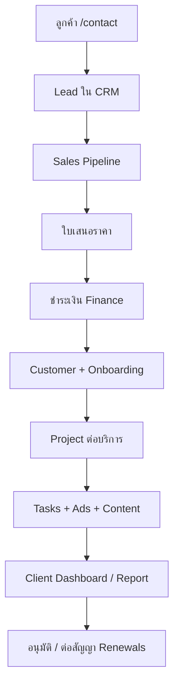

# NP Create Platform — โครงสร้างระบบสำหรับพัฒนา

เอกสารนี้แมป **สเปกธุรกิจ** (NP Create OS + Client Workspace + Shared Database) กับ **โค้ดและฐานข้อมูลปัจจุบัน** เพื่อให้ทีม Dev รู้ว่าสร้างอะไรแล้ว อะไรอยู่ Phase ไหน และ entity ไหนตรงกับตารางใด

---

## 1. แนวคิดหลัก (3 ชั้น)

```
ลูกค้า
  ↓
Client Workspace     →  /app/client/*  (บทบาท client + ทีม preview)
  ↓
Shared Database      →  Supabase (PostgreSQL + RLS + Storage)
  ↓
NP Create OS         →  /app/*  (ทีมภายใน)
  ↓
Sales / Account / Ads / Content / Admin / CEO
```

**หัวใจ:** ลูกค้ากรอกครั้งเดียว → ทีมเห็นทันที → ทีมอัปเดตครั้งเดียว → ลูกค้าเห็นความคืบหน้าทันที

---

## 2. แมป Module สเปก → โค้ดปัจจุบัน

| # | Module สเปก | สถานะ | Route / โมดูล | ตาราง / หมายเหตุ |
|---|-------------|--------|----------------|------------------|
| 1 | Client Contact / Inquiry | **ใหม่** | `/contact` (สาธารณะ) | `leads` + RPC `submit_public_inquiry` |
| 2 | Sales CRM / Pipeline | พร้อมใช้ | `/app/crm` | `leads`, `lead_status` |
| 3 | Quotation / Payment | **ขยายแล้ว** | `/app/sales`, `/q/:token`, `/app/finance` | `quotations` + RPC สาธารณะ, `payments` |
| 4 | Customer / Brand | พร้อมใช้ | `/app/customers/:id` | `customers` = Customer 360 |
| 5 | Project Workspace | **เพิ่มแล้ว** | `/app/projects` | `projects` (1 ลูกค้าหลายโปรเจกต์) |
| 6 | Brief Form | **MVP** | `/app/onboarding`, `/app/client/brief` | บรีฟ + อัปโหลดไฟล์ + แจ้ง Account |
| 7 | Task Management | พร้อมใช้ | `/app/tasks` | `tasks` + `project_id` |
| 8 | Group Chat | **ขยายแล้ว** | `/app/chat`, `/app/client/chat`, แชทในโปรเจกต์ | inbox, แนบไฟล์, เสียง/วิดีโอ, @mention, อ่านแล้ว, ปักหมุด, reaction (`00054`–`00057`) |
| 9 | Ads Management | พร้อมใช้ | `/app/ads` | `campaigns`, `daily_metrics` |
| 10 | Content Management | พร้อมใช้ | `/app/content` | `content_jobs` |
| 11 | Creator / TikTok One | พร้อมใช้ | `/app/creators` | `creators`, `creator_campaigns` |
| 12 | Report Management | **ขยายแล้ว** | `/app/client/reports`, `/app/reports` | รายงานแอดรายเดือน + พิมพ์ PDF (client), รายงานทีมขั้นสูง |
| 13 | Finance Management | พร้อมใช้ | `/app/finance`, `/app/renewals` | `payments`, `contract_renewals` |
| 14 | Notification Center | พร้อมใช้ | `/app/notifications` | `notifications` |

### โมดูลเสริมที่มีแล้ว (นอกสเปก 14 ข้อ แต่สนับสนุน Ops)

| โมดูล | Route | หน้าที่ |
|--------|-------|---------|
| Executive Dashboard | `/app/dashboard` | KPI ผู้บริหาร |
| Work Hub | `/app/work` | งานของฉันรวมศูนย์ |
| Ops Center | `/app/ops` | งานค้าง / เคสเร่ง |
| AI Assistant | `/app/assistant` | Phase 5 สเปก |
| User Admin | `/app/admin` | บทบาท + สร้างพนักงาน + ตั้ง Sales รับ Lead (`/contact`) |
| Activity / Weekly | `/app/activity`, `/app/weekly` | บันทึก + สรุปสัปดาห์ |
| Global Search | `/app/search` (⌘K) | ค้นหาข้ามโมดูล |

---

## 3. แมป Entity สเปก → ฐานข้อมูล

| Entity สเปก | ตารางจริง | หมายเหตุ |
|-------------|-----------|----------|
| Customer | `customers` | ผูก `lead_id`, owners, สัญญา |
| Brand | ฟิลด์ใน `customers.brand_name` | แยก brand หลายโปรเจกต์ผ่าน `projects` |
| Lead | `leads` | Pipeline ขาย |
| Project | `projects` | สถานะงานต่อบริการ (GMV Max, Content, …) |
| Brief | `onboarding_forms` + checklist | GMV Max fields ครบตามสเปก |
| Task | `tasks` | แยก `department` |
| Chat | `chat_rooms`, `chat_messages` | 1 ห้องต่อโปรเจกต์ |
| File | Storage buckets + lead attachments | |
| Ads Metrics | `daily_metrics` | ต่อ `campaigns` |
| Content Asset | `content_jobs` | |
| Creator | `creators` | |
| Report | รวมจาก metrics + client portal view | |
| Payment | `payments` + quotation | |
| Notification | `notifications` | |

---

## 4. Flow หลัก vs ระบบจริง



| ขั้นสเปก | การทำงานในระบบ |
|----------|------------------|
| ลูกค้าติดต่อ | `/contact` → `submit_public_inquiry` → Lead `interested`, channel `website` |
| Sales ติดตาม | `/app/crm` เปลี่ยน `lead_status` |
| ใบเสนอราคา | `/app/sales` → `quotations` |
| ชำระเงิน | `/app/finance` → สร้าง customer (trigger/hook มีใน migration 11) |
| บรีฟ | `/app/onboarding/:customerId` (ทีม) หรือ `/app/client/brief` (ลูกค้า) |
| Assign งาน | `/app/tasks` + owners บน customer/project |
| ลูกค้าเห็นความคืบหน้า | `/app/client` onboarding % + ads summary |

---

## 5. Role & Permission

บทบาทตรงกับ enum `public.app_role` ใน migration `00001_foundation.sql`

| สเปก | `app_role` | หมายเหตุ |
|------|------------|----------|
| CEO | `ceo` | full access |
| Operations | `operations` | privileged |
| Sales | `sales` | leads, sales |
| Account | `account` | customers, onboarding |
| Ads Specialist | `ads` | ads module |
| Senior Ads | `senior_ads` | ads + alerts |
| Content | `content` | content jobs |
| Creator Manager | ใช้ `content` + `account` | ยังไม่มี role แยก — พิจารณาเพิ่ม enum ภายหลัง |
| Admin / Finance | `admin` | finance |
| Client | `client` | `client_customer_access` |
| Dev | `dev` | ระบบ |

รายละเอียดสิทธิ์รายโมดูล: `src/shared/auth/access.ts`

---

## 6. Frontend Routes (สเปก vs จริง)

### NP Create OS (ทีม)

| สเปกแนะนำ | Route จริง |
|-----------|------------|
| `/login` | `/login` |
| `/dashboard` | `/app/dashboard` |
| `/crm/leads` | `/app/crm` |
| `/crm/quotations` | `/app/sales` |
| `/customers/[id]` | `/app/customers/:id` |
| `/projects/[id]` | `/app/projects/:id` |
| `/tasks` | `/app/tasks` |
| `/chat` | `/app/chat` (กล่องข้อความทีม) |
| `/ads` | `/app/ads` |
| `/content` | `/app/content` |
| `/finance` | `/app/finance` |
| `/reports` | `/app/reports` |
| `/notifications` | `/app/notifications` |

### Client Workspace

| สเปกแนะนำ | Route จริง |
|-----------|------------|
| `/client` | `/app/client` |
| `/client/projects` | `/app/client/projects` |
| `/client/brief` | `/app/client/brief` |
| `/client/chat` | `/app/client/chat` *(placeholder)* |
| `/client/reports` | `/app/client/reports` |
| `/client/payment` | `/app/client/payment` *(ลิงก์สถานะสัญญา)* |

---

## 7. MVP Phase 1 (สเปก 10 ข้อ)

| MVP สเปก | สถานะใน repo |
|----------|----------------|
| 1. Login + Role | ✅ |
| 2. Contact Form | ✅ `/contact` |
| 3. Sales CRM | ✅ |
| 4. Customer Profile | ✅ Customer 360 |
| 5. Project Workspace | ✅ เริ่มต้น `/app/projects` |
| 6. Brief Form | ✅ onboarding + client brief |
| 7. Task Board | ✅ |
| 8. Group Chat | ⏳ Phase ถัดไป |
| 9. Notification Center | ✅ |
| 10. Client Dashboard | ✅ + sub-routes |

---

## 8. Phase ถัดไป (ตามสเปก)

| Phase สเปก | โมดูลที่มีแล้วใน repo |
|------------|------------------------|
| Phase 2: Ads + Report | `/app/ads`, `/app/reports`, `/app/client/reports` (รายเดือน + PDF) |
| Phase 3: Finance + Document | `/app/finance`, `/app/sales`, renewals |
| Phase 4: Content + Creator | `/app/content`, `/app/creators` |
| Phase 5: Automation + AI | `/app/assistant`, notifications |

**งานที่ควรทำต่อ:** Group Chat, LINE/Email automation, ฟอร์มบรีฟ step-by-step แยกตาม service type, Project ↔ Task ผูก `project_id`

---

## 9. UI / UX

สเปก: Primary ดำ/Charcoal, Accent แดง NP Create — แอปปัจจุบันใช้ธีม dark glass (`src/index.css`, `crm.css`). แนะนำค่อย ๆ ปรับ token ให้ตรงแบรนด์โดยไม่กระทบทุกหน้าพร้อมกัน

UX หลักที่ระบบรองรับแล้ว:
- สถานะ Lead / Task / Quotation ชัดเจน
- Work Hub + Notifications
- RLS แยก client vs staff
- Customer 360 รวมลิงก์ข้ามโมดูล

---

## 10. การตั้งค่าสำหรับฟอร์มติดต่อสาธารณะ

หลัง `db:push` migration `00044`:

```sql
INSERT INTO public.platform_settings (key, value)
VALUES (
  'default_lead_owner_id',
  to_jsonb('UUID-ของ-sales-default'::text)
)
ON CONFLICT (key) DO UPDATE SET value = EXCLUDED.value;
```

แทน `UUID-ของ-sales-default` ด้วย `profiles.id` ของ Sales ที่รับ Lead อัตโนมัติ

---

## 11. แผนพัฒนาต่อ (ลำดับความสำคัญ)

### สถานะปัจจุบัน (พร้อมใช้ / ต้องทำก่อน go-live เต็มรูป)

| ลำดับ | งาน | สถานะ | หมายเหตุ |
|-------|-----|--------|----------|
| A | `/contact` UI + route | ✅ UI ใหม่ | Deploy โปรเจกต์ `ops-npcreate` |
| B | RPC `submit_public_inquiry` + antiflood | ✅ | migration `00044`–`00047` |
| C | `platform_settings.default_lead_owner_id` | ✅ | `/app/admin` — เลือก Sales รับ Lead จาก `/contact` |
| D | Client Workspace แท็บ | ✅ | `/app/client/*` |
| E | โมดูล Projects | ✅ พื้นฐาน | ขยายผูก Task / Timeline |

### Sprint ถัดไป — ทำให้ระบบครบ MVP สเปก

1. ~~**Project ↔ Task**~~ — `tasks.project_id`, รายการงานในโปรเจกต์ ✅  
2. ~~**Group Chat**~~ — inbox, อ่านแล้ว, แจ้งเตือน, แนบไฟล์, สร้าง Task + ข้อความระบบ ✅ (`00054`–`00055`)  
3. ~~**Brief ลูกค้า**~~ — อัปโหลดไฟล์, client บันทึก/ส่งบรีฟ, แจ้ง Account ✅  
4. ~~**Quotation flow**~~ — สถานะ `viewed` / `accepted`, ลิงก์ `/q/:token` ✅ (`00051` enum + `00052` RPC)  
5. ~~**Wizard สร้างบัญชีลูกค้า**~~ — `/app/admin` wizard 3 ขั้น + Edge `create-client-user` ✅ (`00053`)  

### Phase 2–5 (มีโมดูลแล้ว — ขยายความลึก)

| Phase | โฟกัส | โมดูล |
|-------|--------|--------|
| 2 | Ads + Report | `/app/ads`, `/app/reports`, `/app/client/reports` (รายเดือน + PDF) |
| 3 | Finance | `/app/finance`, renewals, เอกสาร PDF |
| 4 | Content + Creator | `/app/content`, `/app/creators` |
| 5 | AI + Automation | `/app/assistant`, LINE/Email แจ้งเตือน |

### โครงสร้าง repo (ไม่แยก Git)

```
src/app/modules/     ← 1 โฟลเดอร์ต่อโมดูล (crm, contact, client, projects, …)
supabase/migrations/ ← schema + RLS + RPC
src/shared/          ← auth, supabase, config, company
```

Vercel production: โปรเจกต์ **`ops-npcreate`** → โดเมน `app.npcreate.co.th`

## 12. สรุปสั้นสำหรับทีม Dev

พัฒนาต่อบน **monolith React + Supabase** — เพิ่ม migration, module ใน `src/app/modules/`, ลงทะเบียน `routes.tsx` + `navigation.ts`

คู่มือผู้ใช้: [`คู่มือการใช้งาน-NP-Create-OS.md`](./คู่มือการใช้งาน-NP-Create-OS.md)

Deploy production: [`DEPLOY-app.npcreate.co.th.md`](./DEPLOY-app.npcreate.co.th.md) — โดเมน **https://app.npcreate.co.th**
