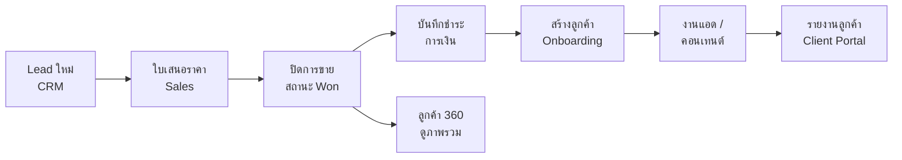

# คู่มือการใช้งาน NP Create OS

**เวอร์ชันเอกสาร:** สำหรับระบบปัจจุบัน (NP Create Operating System)  
**บริษัท:** บริษัท เอ็นพี ครีเอ็ท จำกัด (NP Create) — Online Advertising & Digital Marketing  
**ที่อยู่จดทะเบียน:** 789 หมู่ 5 ต.พระลับ อ.เมืองขอนแก่น จ.ขอนแก่น 40000  
**เลขประจำตัวผู้เสียภาษี:** 0405566003636

---

## สารบัญ

1. [ระบบนี้คืออะไร](#1-ระบบนี้คืออะไร)
2. [การเข้าสู่ระบบ](#2-การเข้าสู่ระบบ)
3. [ภาพรวมหน้าจอและเมนู](#3-ภาพรวมหน้าจอและเมนู)
4. [บทบาทและสิทธิ์การใช้งาน](#4-บทบาทและสิทธิ์การใช้งาน)
5. [Flow งานหลัก (ตั้งแต่ Lead ถึงลูกค้า)](#5-flow-งานหลัก-ตั้งแต่-lead-ถึงลูกค้า)
6. [โมดูลงาน — คู่มือรายหมวด](#6-โมดูลงาน--คู่มือรายหมวด)
7. [ไฟล์แนบ Lead](#7-ไฟล์แนบ-lead)
8. [เอกสารทางการเงินและการขาย](#8-เอกสารทางการเงินและการขาย)
9. [เครื่องมือช่วย: ค้นหา ปักหมุด งานของฉัน](#9-เครื่องมือช่วย-ค้นหา-ปักหมุด-งานของฉัน)
10. [ตั้งค่า ช่วยเหลือ และสถานะระบบ](#10-ตั้งค่า-ช่วยเหลือ-และสถานะระบบ)
11. [ข้อความแจ้งเตือนและการแก้ปัญหา](#11-ข้อความแจ้งเตือนและการแก้ปัญหา)
12. [Checklist เปิดใช้งานจริง (ทีม IT / Ops)](#12-checklist-เปิดใช้งานจริง-ทีม-it--ops)

---

## 1. ระบบนี้คืออะไร

**NP Create OS** เป็นระบบบริหารงานกลางของ NP Create ใช้รวมข้อมูลตั้งแต่ขาย (Lead) การเงิน รับบรีฟลูกค้า งานแอด งานคอนเทนต์ งานภายในทีม ไปจนถึงรายงานลูกค้าและภาพรวมผู้บริหาร

### จุดประสงค์หลัก

| เป้าหมาย | รายละเอียด |
|----------|------------|
| ข้อมูลรวมศูนย์ | Lead, ลูกค้า, การชำระเงิน, งานแอด/คอนเทนต์ อยู่ในที่เดียว |
| สิทธิ์ตามบทบาท | แต่ละทีมเห็นเฉพาะส่วนที่เกี่ยวข้อง (RLS ฝั่งฐานข้อมูล) |
| ติดตามงาน | งานของฉัน, แจ้งเตือน, สัญญาใกล้หมดอายุ |
| เอกสาร | ใบเสนอราคา, ใบเสร็จ/ใบกำกับ พร้อมหัวเอกสารบริษัท |

### สิ่งที่ระบบ **ไม่ใช่**

- ไม่ใช่ระบบยิงแอดโดยตรง (Facebook/TikTok Ads Manager) — บันทึกผลและงานใน OS
- ไม่แทนที่โปรแกรมบัญชีเต็มรูปแบบ — บันทึกการชำระและออกเอกสารพื้นฐาน
- ลูกค้า (บทบาท Client) เห็นเฉพาะ **รายงานลูกค้า** และผู้ช่วย AI ในขอบเขตของตน

---

## 2. การเข้าสู่ระบบ

### ขั้นตอน

1. เปิด URL ของระบบที่ทีม IT แจ้ง (Production)
2. หากยังไม่ล็อกอิน จะไปหน้า **เข้าสู่ระบบ**
3. กรอก **รหัสผู้ใช้** (User ID) และ **รหัสผ่าน** ที่ผู้ดูแลระบบแจ้ง
4. กด **เข้าสู่ระบบ** → ไปที่ **หน้าหลัก** (`/app`)

### รหัสผู้ใช้ (login_id)

| รายการ | รายละเอียด |
|--------|------------|
| รูปแบบ | ตัวอักษร a-z, ตัวเลข 0-9, `.` `_` `-` ความยาว 3–32 ตัว |
| ตัวอย่าง | `sales01`, `account.np`, `admin_finance` |
| **ไม่ใช่อีเมล** | หน้า login ไม่รับอีเมล — ใช้รหัสผู้ใช้เท่านั้น |
| ดูรหัสของตน | **ตั้งค่า** → รหัสผู้ใช้ (เข้าสู่ระบบ) |
| ผู้ใช้เดิม | หลัง migration ระบบตั้งรหัสจากส่วนก่อน `@` ของอีเมล (เช่น `ceo@...` → `ceo`) |

ระบบยังใช้อีเมลภายในกับ Supabase Auth — ผู้ใช้ไม่ต้องจำอีเมลเมื่อเข้าใช้งาน

### สร้างบัญชีพนักงาน (CEO / ผู้จัดการ)

1. ไป **จัดการผู้ใช้** (`/app/admin`)
2. กรอกในฟอร์ม **สร้างบัญชีพนักงาน**: รหัสผู้ใช้, ชื่อ, รหัสผ่านเริ่มต้น, บทบาท
3. แจ้งพนักงานให้ login ด้วย **รหัสผู้ใช้** + รหัสผ่าน (แนะนำให้เปลี่ยนรหัสหลังเข้าใช้ครั้งแรก)

| ผู้สร้าง | มอบบทบาทได้ |
|----------|-------------|
| **CEO** | ทุกบทบาทยกเว้น Dev |
| **ผู้จัดการ (Operations)** | Sales, Account, Ads, Content, Admin, Client ฯลฯ — **ไม่** รวม CEO / Operations |
| **Dev** | เหมือน CEO (สำหรับทีมเทคนิค) |

**หมายเหตุ IT:** ต้อง deploy Edge Function `create-employee` และรัน migration `00039` บน Supabase

### หมายเหตุสำคัญ

- บัญชีพนักงานสร้างผ่านระบบโดย **CEO / ผู้จัดการ (Operations)** — ไม่ต้องสร้างใน Supabase Dashboard เอง
- ผู้ดูแลต้องแจ้ง **รหัสผู้ใช้** และรหัสผ่านให้พนักงาน (ไม่ใช่แค่อีเมล)
- หากล็อกอินแล้วแต่ไม่เห็นเมนูที่ต้องการ → ติดต่อผู้ดูแลให้ตรวจบทบาท
- หากลืมรหัสผ่าน → ติดต่อผู้ดูแล (รีเซ็ตผ่าน Supabase)
- ข้อความ «รหัสผู้ใช้หรือรหัสผ่านไม่ถูกต้อง» แสดงเมื่อรหัสผิดหรือบัญชีถูกปิด (`is_active = false`)

---

## 3. ภาพรวมหน้าจอและเมนู

### โครงสร้างหลัก

```
┌─────────────────────────────────────────────────────────┐
│  แถบเมนู (Sidebar)     │  พื้นที่เนื้อหา (หน้างาน)      │
│  · โลโก้ NP Create     │  · หัวข้อหน้า                 │
│  · รายการเมนูตามสิทธิ์ │  · การ์ด / ตาราง / ฟอร์ม      │
│  · ปุ่มพับเมนู ‹ ›     │  · ปุ่มดำเนินการ              │
└─────────────────────────────────────────────────────────┘
```

### หน้าหลัก (`/app`)

หน้าแรกหลังล็อกอิน แสดงตามบทบาท:

- **ตัวเลขสรุป (KPI):** งานเกินกำหนด, งานวันนี้, แจ้งเตือน, งานในรายการ
- **ตัวอย่างงานของฉัน:** ลิงก์ไปรายการสำคัญ
- **เข้าถึงด่วน:** หน้าที่ปักหมุดไว้
- **เมนูสำคัญ / โมดูลทั้งหมด:** ทางลัดไปแต่ละโมดูล

### ลำดับเมนูในแถบข้าง (ทีมภายใน)

เมนูที่แสดงขึ้นกับบทบาท โดยทั่วไปเรียงดังนี้:

| ลำดับ | เมนู | หน้าที่โดยย่อ |
|------|------|----------------|
| 1 | หน้าหลัก | ภาพรวมและทางลัด |
| 2 | งานของฉัน | งานค้าง Lead สัญญา การเงิน แจ้งเตือน |
| 3 | ลูกค้าเป้าหมาย (CRM) | Lead และสถานะขาย |
| 4 | ขาย / ใบเสนอราคา | ใบเสนอราคา |
| 5 | การเงิน | รายการชำระเงิน สลิป ใบเสร็จ |
| 6 | รับบรีฟลูกค้า | Onboarding หลังปิดการขาย |
| 7 | ลูกค้า 360 | ข้อมูลลูกค้ารวมศูนย์ |
| 8 | งานยิงแอด | แคมเปญและรายงานแอด |
| 9 | งานคอนเทนต์ | คิวงานคอนเทนต์ / UGC |
| 10 | งานภายใน | Task ทีม |
| 11 | ครีเอเตอร์ | ฐานข้อมูลครีเอเตอร์ |
| 12 | ต่อสัญญา | สัญญาใกล้หมดอายุ |
| 13 | รายงานลูกค้า | พอร์ทัลลูกค้า (หรือมุมมอง staff) |
| 14 | รายงานขั้นสูง | รายงานสรุป |
| 15 | ภาพรวมผู้บริหาร | Dashboard KPI |
| 16 | ผู้ช่วย AI | ถามข้อมูลในระบบ |
| 17 | จัดการผู้ใช้ | ผู้ใช้และบทบาท |
| 18 | ศูนย์ Ops | เช็กลิสต์ deploy |
| 19 | ตั้งค่า | บัญชีและการจัดวาง |
| 20 | ช่วยเหลือ | เช็กลิสต์ Flow คีย์ลัด |
| 21 | สถานะ | ตรวจการเชื่อมต่อระบบ |

### เมนูที่เข้าทางอื่น (ไม่แสดงในแถบข้าง)

| ฟีเจอร์ | วิธีเข้า |
|---------|----------|
| ค้นหารวม | `⌘K` / `Ctrl+K` หรือหน้า `/app/search` |
| แจ้งเตือน | `/app/notifications` หรือ badge ที่ **งานของฉัน** |
| บันทึกกิจกรรม | `/app/activity` |
| สรุปรายสัปดาห์ | `/app/weekly` |
| ไทม์ไลน์งาน | รวมอยู่ใน **งานของฉัน** (เดิม `/app/timeline` redirect) |
| เริ่มใช้งาน (เช็กลิสต์) | `/app/help#start` |
| ตารางคีย์ลัด | `/app/help#keyboard` หรือ `/app/keyboard` |
| การจัดวาง | `/app/settings#layout` |
| เกี่ยวกับแอป | `/app/status#about` |

---

## 4. บทบาทและสิทธิ์การใช้งาน

### รายการบทบาท

| บทบาท | ชื่อแสดง | ภาพรวม |
|--------|----------|--------|
| `ceo` | CEO | เข้าถึงเกือบทุกโมดูล แก้ไขข้ามทีมได้ |
| `operations` | Operations | บริหารข้ามแผนก สิทธิ์ privileged |
| `sales` | Sales | CRM, ขาย, ดูการเงินบางส่วน |
| `account` | Account | Onboarding, ลูกค้า, แอด, คอนเทนต์ |
| `ads` | Ads Specialist | งานยิงแอด |
| `senior_ads` | Senior Ads | แอด + สิทธิ์ข้าม claim |
| `content` | Content / Creative | งานคอนเทนต์ |
| `admin` | Admin / Finance | การเงิน อ่าน Lead ทั้งทีม (แก้ Lead จำกัด) |
| `dev` | Dev / Automation | สิทธิ์พัฒนา/ทดสอบ |
| `client` | Client | รายงานลูกค้า + AI เฉพาะข้อมูลตน |

### ระดับสิทธิ์พิเศษ

| กลุ่ม | บทบาท | ความหมาย |
|------|--------|----------|
| **Privileged** | CEO, Operations, Dev | แก้ไข/ดูข้ามเจ้าของได้ในหลายโมดูล |
| **Nav full access** | + Admin | เห็นเมนูข้ามโมดูล (บางเมนูยังจำกัด เช่น Ops) |

### ตารางสิทธิ์โดยสรุป (ทีมภายใน)

| โมดูล | Sales | Admin | Account | Ads | Content | Client |
|-------|:-----:|:-----:|:-------:|:---:|:-------:|:------:|
| CRM / Lead | ● เจ้าของ | อ่าน | — | — | — | — |
| ใบเสนอราคา | ● | อ่าน | — | — | — | — |
| การเงิน | อ่าน | ● | อ่าน | — | — | — |
| Onboarding | — | — | ● | — | — | — |
| ลูกค้า 360 | ● | ● | ● | ● | ● | — |
| งานแอด | — | — | ● | ● | — | — |
| งานคอนเทนต์ | — | อ่าน | ● | — | ● | — |
| รายงานลูกค้า | — | ● | ● | — | — | ● |
| จัดการผู้ใช้ | — | — | — | — | — | — |

(● = ใช้งานหลัก · อ่าน = ดูได้จำกัดตาม RLS · — = ไม่มีเมนูหรือไม่มีสิทธิ์)

> **หมายเหตุ:** ตารางเป็นภาพรวม — สิทธิ์จริงตรวจที่ฐานข้อมูล (RLS) ทุกครั้ง

---

## 5. Flow งานหลัก (ตั้งแต่ Lead ถึงลูกค้า)

### แผนภาพ Flow



### ขั้นตอนละเอียด

#### ขั้นที่ 1 — รับ Lead (CRM)

1. ไป **ลูกค้าเป้าหมาย** → **เพิ่ม Lead ใหม่**
2. กรอก: ชื่อแบรนด์, ผู้ติดต่อ, ช่องทาง, ประเภทธุรกิจ, แพ็กเกจที่สนใจ, สถานะ
3. แนบไฟล์ (รูป/PDF) ถ้ามี — ดู [หมวด 7](#7-ไฟล์แนบ-lead)
4. อัปเดตสถานะตามการติดตาม:
   - สนใจ → นัดคุย → ส่งใบเสนอราคา → รอชำระเงิน → **ปิดการขายแล้ว** / ไม่สนใจ / ติดตามใหม่

#### ขั้นที่ 2 — ใบเสนอราคา (Sales)

1. จากหน้า Lead → **สร้างใบเสนอราคา** (เมื่อยังไม่ปิดการขาย)
2. กรอกรายการ ราคา เงื่อนไข
3. ใช้ **พิมพ์ / PDF** — มีหัวเอกสารบริษัท NP Create อัตโนมัติ
4. เปลี่ยนสถานะ Lead เป็น **ส่งใบเสนอราคา** หรือ **รอชำระเงิน**

#### ขั้นที่ 3 — การเงิน (Admin / Finance)

1. ไป **การเงิน** → บันทึกรายการชำระเงิน
2. แนบ **สลิปชำระเงิน** (รูปหรือ PDF)
3. **ยืนยันชำระเงิน** — ระบบเปิดใช้งานลูกค้า / ดำเนิน Onboarding ต่อ
4. ออก **ใบเสร็จ** หรือ **ใบกำกับภาษี** จากหน้ารายการชำระ (พิมพ์/PDF)

#### ขั้นที่ 4 — รับบรีฟ (Onboarding)

1. ไป **รับบรีฟลูกค้า** → เลือกลูกค้าที่ชำระแล้ว
2. กรอกบรีฟแบรนด์ เป้าหมาย ช่องทาง พร้อมยิงแอดหรือไม่
3. มอบหมายงานต่อทีมแอด/คอนเทนต์

#### ขั้นที่ 5 — ดำเนินงาน

- **งานยิงแอด:** บันทึกแคมเปญ Spend รายงานรายวัน
- **งานคอนเทนต์:** สร้างงาน มอบหมาย ติดตามสถานะ
- **งานภายใน:** Task ทั่วไปของทีม

#### ขั้นที่ 6 — มุมมองลูกค้า

- **ลูกค้า 360:** ข้อมูลติดต่อ การเงิน แอด งาน ต่อสัญญา ไฟล์จาก Lead ลิงก์ไปโมดูลย่อย
- **รายงานลูกค้า:** ลูกค้า login ดูรายงานและถาม AI ได้เฉพาะข้อมูลของตน

#### ขั้นที่ 7 — ต่อสัญญา

- เมนู **ต่อสัญญา** แสดงลูกค้าที่สัญญาใกล้หมดอายุ
- Account / Sales ติดตามต่ออายุ

---

## 6. โมดูลงาน — คู่มือรายหมวด

### 6.1 งานของฉัน (`/app/work`)

**ใครใช้:** ทีมภายใน (ยกเว้น Client อย่างเดียว)

**หน้าที่:**

- รวมงานที่ต้องทำ: งานภายใน, Lead ที่ต้องติดตาม, สัญญาใกล้หมด, การเงินค้าง, แจ้งเตือน
- กรองตามประเภท ช่วงเวลา (7 / 14 / 30 วัน)
- คลิกรายการเพื่อไปหน้าที่เกี่ยวข้อง (ถ้ามีสิทธิ์)

**เคล็ดลับ:** ตรวจทุกเช้าจากหน้านี้หรือจาก KPI บนหน้าหลัก

---

### 6.2 ลูกค้าเป้าหมาย — CRM (`/app/crm`)

**ใครใช้:** CEO, Operations, Sales, Dev

| การทำงาน | วิธีทำ |
|----------|--------|
| ดูรายการ Lead | หน้ารายการ → กรองสถานะ / ช่องทาง / เจ้าของ |
| สร้าง Lead | ปุ่มเพิ่ม Lead ใหม่ |
| แก้ไข Lead | คลิกแถว → แก้ฟอร์ม → บันทึก |
| ดูอย่างเดียว | Admin เห็น Lead ทีม แต่แก้ไม่ได้ (ยกเว้น privileged) |
| ลบ Lead | เฉพาะ CEO / Operations / Dev |
| ไฟล์แนบ | ดู [หมวด 7](#7-ไฟล์แนบ-lead) |

**สถานะ Lead:**

| ค่า | ความหมาย |
|-----|----------|
| สนใจ | Lead ใหม่ / กำลังสนใจ |
| นัดคุย | นัดหมายแล้ว |
| ส่งใบเสนอราคา | ส่ง QT แล้ว |
| รอชำระเงิน | รอโอน/ชำระ |
| ปิดการขายแล้ว | Won — มี Customer ในระบบ |
| ไม่สนใจ | ปิดทางขาย |
| ติดตามใหม่ | กลับมาติดตามภายหลัง |

**ช่องทาง:** Facebook, TikTok, Website, Line, Referral, อื่น ๆ

---

### 6.3 ขาย / ใบเสนอราคา (`/app/sales`)

**ใครใช้:** CEO, Operations, Sales, Admin (อ่าน), Dev

| การทำงาน | วิธีทำ |
|----------|--------|
| สร้างใบเสนอราคา | รายการ → สร้างใหม่ หรือจาก Lead |
| แก้ไข / บันทึก | หน้า editor |
| พิมพ์ PDF | ปุ่มพิมพ์ — ใช้หัวเอกสารบริษัท |
| ลบ | ตามสิทธิ์ privileged / เจ้าของ |

---

### 6.4 การเงิน (`/app/finance`)

**ใครใช้:** CEO, Admin, Dev, Sales (อ่าน), Account (อ่าน)

| การทำงาน | ใครทำได้ |
|----------|----------|
| ดูรายการชำระ | ทุกบทบาทที่มีเมนู |
| บันทึก / แก้ไข / ยืนยันชำระ | Admin, CEO, Operations, Dev |
| แนบสลิป | ผู้แก้ไขได้ |
| ออกใบเสร็จ / ใบกำกับ | ผู้จัดการการเงิน |

**Flow ยืนยันชำระ:** บันทึกรายการ → แนบสลิป → ยืนยันชำระเงิน → ลูกค้าพร้อม Onboarding

---

### 6.5 รับบรีฟลูกค้า (`/app/onboarding`)

**ใครใช้:** CEO, Operations, Account, Dev

- รายการลูกค้าที่ต้องรับบรีฟหรือกำลังดำเนินการ
- เปิดรายละเอียด → กรอกบรีฟ → บันทึก
- ตั้งค่า **พร้อมยิงแอด** เมื่อข้อมูลครบ

---

### 6.6 ลูกค้า 360 (`/app/customers`)

**ใครใช้:** ทีมภายในส่วนใหญ่ (ตามตารางบทบาท)

| ส่วน | รายละเอียด |
|------|------------|
| ข้อมูลติดต่อ | แบรนด์ ผู้ติดต่อ สัญญา |
| การ์ดสรุป | การเงิน แอด งาน คอนเทนต์ ต่อสัญญา (ตามสิทธิ์) |
| ลิงก์ด่วน | Onboarding, การเงิน, แอด, งาน, Lead ต้นทาง |
| ไฟล์แนบ Lead | ดู/ดาวน์โหลดจาก Lead ต้นทาง (ไม่อัปโหลดที่นี่) |
| ไทม์ไลน์ | เหตุการณ์สำคัญของลูกค้า |
| ส่งออก CSV | สรุปข้อมูลที่มองเห็น |

**หมายเหตุ:** บางบทบาทเห็นเฉพาะตัวเลขที่ RLS อนุญาต (แบนเนอร์ “แสดงเฉพาะที่เข้าถึงได้”)

---

### 6.7 งานยิงแอด (`/app/ads`)

**ใครใช้:** CEO, Operations, Ads, Senior Ads, Account, Dev

- รายการลูกค้าที่มีงานแอด
- รายงานรายวัน Spend แคมเปญ
- Senior Ads / Account / Admin บางกรณี **claim** หรือดูข้ามเจ้าของได้

---

### 6.8 งานคอนเทนต์ (`/app/content`)

**ใครใช้:** CEO, Operations, Content, Account, Dev (+ Admin อ่าน)

- สร้างงาน มอบหมาย เปลี่ยนสถานะ
- Content / Account แก้ไขคิวได้
- Admin มักเป็น **อ่านอย่างเดียว**

---

### 6.9 งานภายใน (`/app/tasks`)

**ใครใช้:** ทีมภายใน (ยกเว้น Client)

- สร้าง Task มอบหมาย กำหนดวันครบ
- มุมมองทีมสำหรับ Account / Senior Ads / Admin บางบทบาท

---

### 6.10 ครีเอเตอร์ (`/app/creators`)

**ใครใช้:** CEO, Operations, Content, Account, Dev

- ฐานข้อมูลครีเอเตอร์ / Influencer
- ใช้ประกอบงาน TikTok One / Creator

---

### 6.11 ต่อสัญญา (`/app/renewals`)

**ใครใช้:** CEO, Operations, Account, Sales, Admin, Dev

- ติดตามสัญญาใกล้หมดอายุ
- อัปเดตสถานะการต่อสัญญา

---

### 6.12 รายงานลูกค้า (`/app/client`)

| ผู้ใช้ | การใช้งาน |
|--------|-----------|
| **Client** | ดูรายงานของตนเอง ถามผู้ช่วย AI |
| **Staff** | เปิดดูมุมมองลูกค้า (ตามสิทธิ์) |

---

### 6.13 รายงานขั้นสูง (`/app/reports`)

**ใครใช้:** CEO, Operations, Account, Admin, Dev

- รายงานสรุปขั้นสูง (ตามที่ระบบเปิดใช้)

---

### 6.14 ภาพรวมผู้บริหาร (`/app/dashboard`)

**ใครใช้:** CEO, Operations, Admin, Dev

- KPI ภาพรวมธุรกิจ
- ใช้ประกอบการตัดสินใจรายสัปดาห์/รายเดือน

---

### 6.15 ผู้ช่วย AI (`/app/assistant`)

**ใครใช้:** ทีม staff ที่มีเมนู (ไม่รวม Client อย่างเดียวในบางการตั้งค่า)

- ถามคำถามจากข้อมูลในระบบ
- Client ใช้ AI ใน **รายงานลูกค้า** เท่านั้น (ข้อมูลของตน)

---

### 6.16 จัดการผู้ใช้ (`/app/admin`)

**ใครใช้:** CEO, Operations, Dev เท่านั้น

- สร้าง/แก้ไขผู้ใช้ มอบบทบาท
- **บันทึก audit** ที่ `/app/admin/logs`

---

### 6.17 แจ้งเตือน (`/app/notifications`)

- แจ้งเตือนในระบบตามเหตุการณ์
- Badge แสดงที่เมนู **งานของฉัน**

---

### 6.18 ศูนย์ Ops (`/app/ops`)

**ใครใช้:** CEO, Operations, Dev

- เช็กลิสต์ก่อน deploy / เปิดใช้งาน Production

---

### 6.19 บันทึกกิจกรรม & สรุปรายสัปดาห์

| หน้า | สิทธิ์โดยย่อ |
|------|-------------|
| `/app/activity` | Operations, Account, Admin + Privileged |
| `/app/weekly` | CEO, Operations, Account, Admin, Dev |

---

## 7. ไฟล์แนบ Lead

### ที่เก็บ

- คลาวด์ Supabase bucket `leads`
- โครงสร้าง: `{รหัสเจ้าของ}/{รหัส Lead}/{เวลา}_{ชื่อไฟล์เดิม}`
- สูงสุด **10 MB** ต่อไฟล์
- ประเภท: **JPEG, PNG, WebP, PDF**

### หน้า Lead (แก้ไขได้)

| ปุ่ม / ส่วน | การทำงาน |
|-------------|----------|
| **เลือกไฟล์** | อัปโหลด (เฉพาะผู้แก้ไข Lead ได้) |
| **ดู / ปิด** | เปิด-ปิดพรีวิว (รูปและ PDF) |
| **ดาวน์โหลด** | เปิดลิงก์ชั่วคราว |
| **ลบ** | ลบถาวร (ยืนยันก่อน) — ต้องมี migration ลบ storage |
| **ปิดตัวอย่าง** | ปิดกล่องพรีวิว |

### หน้า ลูกค้า 360

- แสดงไฟล์จาก **Lead ต้นทาง** (`lead_id`)
- **ดูและดาวน์โหลดเท่านั้น** — อัปโหลด/ลบที่หน้า Lead
- สิทธิ์ดู: เจ้าของ Lead, Admin, CEO/Operations/Dev (privileged)

### ข้อความแจ้งเตือนที่พบบ่อย

| ข้อความ | สาเหตุ / แนวทาง |
|---------|----------------|
| ไฟล์ใหญ่เกินไป | ลดขนาดหรือบีบอัดให้ ≤ 10 MB |
| ประเภทไฟล์ไม่รองรับ | ใช้รูปหรือ PDF เท่านั้น |
| ไม่มีสิทธิ์ดำเนินการ | ไม่ใช่เจ้าของ Lead / ไม่ใช่ privileged |
| ไม่พบไฟล์ | ถูกลบไปแล้ว — กดรีเฟรช |

---

## 8. เอกสารทางการเงินและการขาย

### ใบเสนอราคา

- หัวเอกสาร: โลโก้ NP Create, ชื่อนิติบุคคล, ที่อยู่, เลขภาษี
- ปุ่ม **พิมพ์** → เลือก “บันทึกเป็น PDF” ในเบราว์เซอร์

### ใบเสร็จ / ใบกำกับภาษี

- ออกจากหน้ารายการชำระเงิน (หลังยืนยันชำระ)
- รูปแบบหัวเอกสารเดียวกับใบเสนอราคา

---

## 9. เครื่องมือช่วย: ค้นหา ปักหมุด งานของฉัน

### Command Palette — `⌘K` / `Ctrl+K`

| ปุ่ม | การทำงาน |
|------|----------|
| พิมพ์คำค้น | ค้นหา Lead, ลูกค้า, งาน |
| ↑ ↓ | เลือกผลลัพธ์ |
| Enter | เปิดรายการ |
| Esc | ปิด |
| ☆ | ปักหมุดหน้าปัจจุบัน (เข้าถึงด่วน) |

### เข้าถึงด่วน (Quick Access)

- ปักหมุดจากหน้าหลักหรือใน Command Palette
- เก็บในเบราว์เซอร์ของผู้ใช้แต่ละคน

### คีย์ลัดอื่น

| ปุ่ม | การทำงาน |
|------|----------|
| `?` หรือ `Shift+/` | เปิดช่วยเหลือ |
| `‹` `›` | พับ/ขยายแถบเมนู |

รายละเอียดครบ: **ช่วยเหลือ** → ตารางคีย์ลัด (`#keyboard`)

---

## 10. ตั้งค่า ช่วยเหลือ และสถานะระบบ

### ตั้งค่า (`/app/settings`)

| หัวข้อ | รายละเอียด |
|--------|------------|
| บัญชี | ดู **รหัสผู้ใช้** และอีเมลภายใน (แก้ไม่ได้) · แก้ **ชื่อที่แสดง** ได้ |
| บทบาท | แสดงบทบาทที่ได้รับ (แก้โดยผู้ดูแล) |
| การจัดวาง | พับแถบเมนูค่าเริ่มต้น (`#layout`) |

### ช่วยเหลือ (`/app/help`)

- เช็กลิสต์เริ่มใช้งาน (`#start`)
- Flow งานหลัก
- เมนูตามบทบาท
- ปุ่มลัดและตารางคีย์ลัด

### สถานะระบบ (`/app/status`)

- เวอร์ชันแอป
- การเชื่อมต่อ Supabase / เซสชัน
- ข้อมูล build (ที่ `#about`)

---

## 11. ข้อความแจ้งเตือนและการแก้ปัญหา

### ทั่วไป

| อาการ | แนวทางแก้ |
|-------|-----------|
| ไม่เห็นเมนู | ตรวจบทบาทที่ตั้งค่า / ล็อกอินใหม่ |
| “ไม่มีสิทธิ์” / RLS | ข้อมูลเป็นของคนอื่น หรือบทบาทอ่านอย่างเดียว |
| โหลดไม่สำเร็จ | ตรวจอินเทอร์เน็ต → หน้าสถานะระบบ → รีเฟรช |
| โหมดพัฒนา | แบนเนอร์เหลือง — ข้อมูลอาจเป็นตัวอย่าง ไม่บันทึกจริง |

### CRM / ไฟล์แนบ

| อาการ | แนวทางแก้ |
|-------|-----------|
| อัปโหลดไม่ได้ | ตรวจขนาด ≤10MB, ประเภทไฟล์, สิทธิ์เจ้าของ Lead |
| ลบไม่ได้ | ตรวจว่า migration `00037` รันบน Supabase แล้ว |
| Admin ไม่เห็นไฟล์ | ตรวจ RLS storage — Admin ควรดูได้ (อ่าน) |
| Customer 360 ไม่มีไฟล์ | ลูกค้าต้องมี `lead_id` และโหลด owner ได้ |

### การเงิน

| อาการ | แนวทางแก้ |
|-------|-----------|
| ยืนยันชำระไม่ได้ | ต้องมีสิทธิ์ Admin/privileged |
| ไม่เห็นสลิป | อัปโหลดใหม่ / ตรวจสิทธิ์อ่าน payments storage |

### ติดต่อผู้ดูแลระบบเมื่อ

- บทบาทผิด / ต้องการเพิ่มเมนู
- Migration ยังไม่รัน
- Supabase ล่มหรือ environment ผิด

---

## 12. Checklist เปิดใช้งานจริง (ทีม IT / Ops)

### ก่อนเปิดให้ทีมใช้

- [ ] Deploy frontend Production
- [ ] ตั้ง `VITE_SUPABASE_URL` และ `VITE_SUPABASE_ANON_KEY`
- [ ] รัน migrations ทั้งหมดบน Supabase (รวม `00037`, `00038`, `00039`)
- [ ] Deploy: `supabase functions deploy create-employee`
- [ ] แจ้งรหัสผู้ใช้ (`login_id`) ให้ทีมทดสอบ login
- [ ] ตรวจ bucket `leads`, `payments`, `briefs` มีอยู่
- [ ] สร้างผู้ใช้และมอบบทบาทใน **จัดการผู้ใช้**
- [ ] ทดสอบล็อกอินด้วยบัญชีจริงอย่างน้อย: Sales, Admin, Account, Client
- [ ] ทดสอบ Flow: Lead → QT → ชำระ → Onboarding → ลูกค้า 360
- [ ] ทดสอบไฟล์แนบ: อัปโหลด ดู ดาวน์โหลด ลบ
- [ ] ทดสอบพิมพ์ใบเสนอราคา / ใบเสร็จ (หัวเอกสารถูกต้อง)
- [ ] ตรวจหน้า **สถานะระบบ** ว่าเชื่อมต่อเขียว

### หลังเปิดใช้งาน

- [ ] แจกคู่มือฉบับนี้ให้ทีม
- [ ] ชี้ทีมไป **ช่วยเหลือ** สำหรับเช็กลิสต์และคีย์ลัด
- [ ] กำหนดผู้รับผิดชอบ Admin การเงินและ Sales CRM
- [ ] สำรองฐานข้อมูล Supabase ตามนโยบาย

---

## ภาคผนวก — แพ็กเกจบริการ (อ้างอิงใน CRM)

GMV Max, คอร์ส GMV Max, TikTok One / Creator, ผลิตคอนเทนต์, Live Commerce, Private Consulting, Software / License, บริการอื่น ๆ

---

## อัปเดตเอกสาร

เมื่อมีฟีเจอร์ใหม่ ให้อัปเดตไฟล์นี้และหน้า **ช่วยเหลือ** ในระบบให้สอดคล้องกัน

**ที่เก็บในโปรเจกต์:** `docs/คู่มือการใช้งาน-NP-Create-OS.md`
